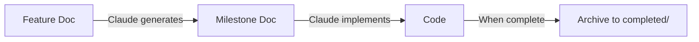

# Plans Directory - Documentation Index (React Native)

> **Last Updated**: 2026-01-16
> **Platform**: React Native (iOS & Android)
>
> This directory contains all feature planning, technical specifications, and project documentation organized by domain and lifecycle stage for the Monolite HR Native mobile app.

## 📋 Table of Contents

- [How to Use](#-how-to-use)
- [Directory Structure](#directory-structure)
- [Workflow Guide](#workflow-guide)
- [Active Plans](#active-plans)
- [Documentation by Domain](#documentation-by-domain)
- [Templates](#templates)
- [Quick Reference](#quick-reference)

---

## 🎯 How to Use

### Create a New Feature - Quick Start

Follow these 4 simple steps to go from idea to implementation:

#### Step 1: Start with Business Requirements
```bash
# Copy the feature template
cp plans/templates/feature-template.md plans/features/finance/new-feature.md

# Edit the file and fill in:
# - Business goals
# - User stories
# - Acceptance criteria
# - Edge cases
```

#### Step 2: Ask Claude to Generate Technical Spec
```
Read plans/features/finance/new-feature.md and create a comprehensive
technical milestone document following plans/templates/milestone-template.md

Save it as plans/milestones/finance/new-feature-technical.md
```

#### Step 3: Ask Claude to Implement
```
Implement the feature described in plans/milestones/finance/new-feature-technical.md
```

#### Step 4: Archive When Done
```bash
# Move both documents to completed folder
mv plans/features/finance/new-feature.md plans/completed/finance/
mv plans/milestones/finance/new-feature-technical.md plans/completed/finance/
```

### Real Example: Invoice Auto-Matching Feature

```bash
# 1. Create feature doc
cp plans/templates/feature-template.md plans/features/finance/invoice-auto-matching.md
# Fill in: "Auto-match incoming invoices to purchase orders"

# 2. Prompt Claude:
"Read plans/features/finance/invoice-auto-matching.md and create technical
milestone following plans/templates/milestone-template.md"

# 3. Prompt Claude:
"Implement plans/milestones/finance/invoice-auto-matching-technical.md"

# 4. When complete, archive:
mv plans/features/finance/invoice-auto-matching.md plans/completed/finance/
mv plans/milestones/finance/invoice-auto-matching-technical.md plans/completed/finance/
```

### Key Files You Need

| File | Purpose | When to Use |
|------|---------|-------------|
| [templates/feature-template.md](templates/feature-template.md) | Business requirements template | Start of every new feature |
| [templates/milestone-template.md](templates/milestone-template.md) | Technical spec template | Reference for Claude generation |
| [analysis/MULTI_INDUSTRY_READINESS_ANALYSIS.md](analysis/MULTI_INDUSTRY_READINESS_ANALYSIS.md) | Gold standard example | See what great docs look like |
| [README.md](README.md) (this file) | Complete guide | Navigation and reference |

---

## 📁 Directory Structure

```
plans/
├── features/          # Business requirements (Claude input)
│   ├── finance/
│   ├── inventory/
│   ├── projects-sites/
│   ├── workforce/
│   ├── documents/
│   └── crm/
│
├── milestones/        # Technical specifications (Claude output → code input)
│   ├── finance/
│   ├── inventory/
│   ├── projects-sites/
│   ├── workforce/
│   ├── documents/
│   └── crm/
│
├── completed/         # Archived finished features
│   ├── finance/
│   ├── inventory/
│   ├── projects-sites/
│   ├── workforce/
│   ├── documents/
│   └── system/
│
├── analysis/          # Research & investigation documents
├── standards/         # Conventions & coding standards
└── templates/         # Reusable document templates
```

---

## 📦 Milestone Structure (Modular Approach)

### Always Use Modular Structure

All technical milestones should use a modular subfolder structure. This provides:
- Better navigation and maintainability
- Clear separation between Database, Backend, Frontend, and Testing
- Built-in status tracking
- Optimized context usage for Claude
- Easier parallel development

### Standard Milestone Structure

Every milestone should be organized as a subfolder:

```
plans/milestones/[domain]/[feature-name]/
├── README.md                  # Master plan (300-500 lines)
├── STATUS.md                  # Implementation progress tracker
├── 01-database-schema.md      # Tables, indexes, RLS policies
├── 02-backend-functions.md    # Edge Functions, DB functions
├── 03-frontend-hooks.md       # React Native hooks and state
├── 04-frontend-components.md  # UI components (src/components/ui/)
├── 05-frontend-screens.md     # Screen implementations (src/pages/)
└── 06-testing.md              # Testing strategy (iOS & Android)
```

**Benefits**:
- Easier navigation (smaller files)
- Better parallel development
- Claude can focus on specific modules
- Clear separation of concerns

### Example: Document Management System

```
plans/milestones/documents/document-management-system/
├── README.md                      # Overview + architecture (400 lines)
├── STATUS.md                      # Progress tracker with percentages
├── 01-database-schema.md          # Tables, RLS, indexes (300 lines)
├── 02-vector-infrastructure.md    # pgvector, embeddings (250 lines)
├── 03-backend-functions.md        # Edge Functions (300 lines)
├── 04-frontend-hooks.md           # React Native hooks (250 lines)
├── 05-frontend-components.md      # UI components (300 lines)
├── 06-knowledge-ui.md             # Knowledge Base screens (350 lines)
└── 07-testing.md                  # Test strategy - iOS & Android (200 lines)
```

### Checking Implementation Status

When you have a milestone with status tracking, use this prompt:

```
Check implementation status for @plans/milestones/[domain]/[feature]/STATUS.md
by comparing against:
1. Supabase database (use MCP tools to check tables, functions, extensions)
2. Codebase (check hooks in src/hooks/, components in src/components/ui/, screens in src/pages/)
3. iOS and Android builds

Update the STATUS.md file with current progress percentages.
```

**For milestones without STATUS.md**, ask Claude to check manually:

```
Check what is implemented and what is left to be implemented in
@plans/milestones/[domain]/[feature-name]-technical.md

Compare against:
1. Supabase database using MCP
2. React Native codebase (hooks, components, screens)
3. Backend (Edge Functions)
4. iOS and Android builds
```

### Required Files in Each Milestone

Every milestone folder must contain:

1. **README.md** - Master plan with architecture overview
2. **STATUS.md** - Progress tracker with 4 phases (Database, Backend, Frontend, Testing)
3. **Module files** - Numbered by implementation order:
   - `01-database-schema.md` - Database changes
   - `02-backend-functions.md` - Edge Functions, DB functions
   - `03-frontend-hooks.md` - React Native hooks
   - `04-frontend-components.md` - UI components (if needed)
   - `05-frontend-screens.md` - Screen implementations (if needed)
   - `06-testing.md` - Testing strategy (iOS & Android)

---

## 🔄 Workflow Guide

### Three-Stage Development Process



### Step 1: Write Feature Document
**Location**: `features/[domain]/[feature-name].md`

**Purpose**: Business requirements, user stories, acceptance criteria

**Template**: Use `templates/feature-template.md`

**Example**:
```bash
# Create new feature doc
cp templates/feature-template.md features/finance/auto-invoice-matching.md
# Edit the file with business requirements
```

### Step 2: Generate Technical Milestone
**Location**: `milestones/[domain]/[feature-name]-technical.md`

**Purpose**: Technical architecture, implementation details, code structure

**Prompt for Claude**:
```
Read plans/features/finance/auto-invoice-matching.md and create a comprehensive
technical milestone document following plans/templates/milestone-template.md
```

### Step 3: Implement Code
**Prompt for Claude**:
```
Implement the feature described in plans/milestones/finance/auto-invoice-matching-technical.md
```

### Step 4: Archive When Complete
```bash
# Move both documents to completed/
mv features/finance/auto-invoice-matching.md completed/finance/
mv milestones/finance/auto-invoice-matching-technical.md completed/finance/
```

---

## 🎯 Active Plans

### Currently In Development

*No active plans yet. Create your first feature plan using the templates!*

---

## 📚 Documentation by Domain

### Available Domains

| Domain | Code | Examples |
|--------|------|----------|
| 💰 Finance | `finance` | Invoices, transactions, forecasts |
| 📦 Inventory | `inventory` | Materials, suppliers, purchase orders |
| 🏗️ Projects & Sites | `projects-sites` | BOQs, cost centers, estimates |
| 👷 Workforce | `workforce` | Work hours, leave requests, profiles |
| 📄 Documents | `documents` | File uploads, versioning, sharing |
| 📞 CRM | `crm` | Customers, contacts, communications |
| ⚙️ System | `system` | Migrations, integrations, architecture |

### Creating Documentation

To create a new feature plan:

1. Create the domain folder if it doesn't exist:
   ```bash
   mkdir -p plans/features/[domain]
   mkdir -p plans/milestones/[domain]
   ```

2. Copy the feature template:
   ```bash
   cp plans/templates/feature-template.md plans/features/[domain]/[feature-name].md
   ```

3. Follow the [Workflow Guide](#-workflow-guide)

---

## 📝 Templates

### Feature Template
**Location**: `templates/feature-template.md`

**Use For**: Writing business requirements and user stories

**Sections Include**:
- Business goal & success metrics
- Problem statement
- User stories
- Business rules & constraints
- Functional requirements (Must/Should/Nice to have)
- User flows
- Edge cases & scenarios
- Data requirements
- UI/UX considerations
- Acceptance criteria

### Milestone Template
**Location**: `templates/milestone-template.md`

**Use For**: Writing technical specifications for React Native

**Sections Include**:
- Architecture overview
- Database schema changes (tables, views, RLS)
- API design (endpoints, contracts)
- React Native implementation (screens, components, hooks, navigation)
- Backend implementation (Edge Functions, DB functions)
- Type definitions
- Implementation steps (phased approach)
- Code examples (React Native patterns)
- Testing strategy (iOS & Android)
- React Native considerations (platform-specific, animations, gestures)
- Security considerations
- Performance considerations
- Rollback plan
- Deployment checklist (App Store / Play Store)

---

## 🚀 Quick Reference

### Creating a New Feature

1. **Copy template**:
   ```bash
   cp plans/templates/feature-template.md plans/features/[domain]/[feature-name].md
   ```

2. **Fill in business requirements**

3. **Generate technical milestone with Claude**:
   ```
   Read plans/features/[domain]/[feature-name].md and create a technical
   milestone using plans/templates/milestone-template.md as structure
   ```

4. **Implement with Claude**:
   ```
   Implement plans/milestones/[domain]/[feature-name]-technical.md
   ```

5. **Archive when complete**:
   ```bash
   mv plans/features/[domain]/[feature-name].md plans/completed/[domain]/
   mv plans/milestones/[domain]/[feature-name]-technical.md plans/completed/[domain]/
   ```

### Status Badges

Use these in document headers:

- 🟢 **ACTIVE** - Currently in development
- 🟡 **IN REVIEW** - Under review/testing
- 🔴 **BLOCKED** - Blocked by dependencies
- ✅ **COMPLETED** - Finished and archived
- 📝 **DRAFT** - Work in progress documentation

### Priority Levels

- **P0** - Critical (security, data loss, system down)
- **P1** - High (major features, important fixes)
- **P2** - Medium (enhancements, minor features)
- **P3** - Low (nice-to-haves, future improvements)

### Domain Codes

| Code | Domain | Examples |
|------|--------|----------|
| `finance` | Financial & Accounting | Invoices, transactions, forecasts |
| `inventory` | Inventory & Store | Materials, suppliers, purchase orders |
| `projects-sites` | Projects & Construction Sites | BOQs, cost centers, estimates |
| `workforce` | Workers & Time Tracking | Work hours, leave requests, profiles |
| `documents` | Document Management | File uploads, versioning, sharing |
| `crm` | Customer Relations | Customers, contacts, communications |
| `system` | System & Infrastructure | Migrations, integrations, architecture |

---

## 📱 React Native Tech Stack

This project uses the following technologies:

| Category | Technology |
|----------|------------|
| **Framework** | React Native 0.74 |
| **Language** | TypeScript |
| **Navigation** | React Navigation (native-stack, bottom-tabs) |
| **State Management** | TanStack React Query |
| **Forms** | React Hook Form + Zod |
| **Styling** | StyleSheet API with centralized theme |
| **Backend** | Supabase (Auth, Database, Edge Functions) |
| **Animations** | react-native-reanimated |
| **Testing** | Jest |

### Project Structure

```
src/
├── components/ui/     # Reusable UI components
├── pages/             # Screen components
├── navigation/        # React Navigation setup
├── hooks/             # Custom hooks (useAuth, etc.)
├── theme/             # Design system tokens
├── integrations/      # Supabase client & types
├── i18n/              # Internationalization
└── lib/               # Utilities
```

---

## 📊 Statistics

### Templates Available
- Feature Template: `templates/feature-template.md`
- Milestone Template: `templates/milestone-template.md`
- Module Template: `templates/milestone-module-template.md`
- Status Template: `templates/STATUS-template.md`

### Active Plans by Domain
- *No active plans yet*

### Completed Features
- *No completed features yet*

### Total Documentation
- Templates: 4 documents
- Active Plans: 0 documents
- Completed: 0 documents

---

## 🎯 Best Practices

### When Writing Feature Docs
1. ✅ Focus on **WHAT** and **WHY**, not **HOW**
2. ✅ Include specific user stories with roles, goals, and benefits
3. ✅ Document all edge cases and error scenarios
4. ✅ Define clear, testable acceptance criteria
5. ✅ Consider multiple user types and their workflows
6. ❌ Don't include technical implementation details

### When Writing Milestone Docs (React Native)
1. ✅ Focus on **HOW** to implement
2. ✅ Include complete database schemas with migrations
3. ✅ Provide React Native code examples (StyleSheet, navigation, hooks)
4. ✅ Document API contracts fully
5. ✅ Include rollback plans
6. ✅ Add testing strategies for both iOS and Android
7. ✅ Consider platform-specific behavior (iOS vs Android)
8. ❌ Don't skip security or performance considerations

### When Using Claude
1. ✅ Provide complete feature docs as context
2. ✅ Request milestone docs before implementation
3. ✅ Review generated specs before coding
4. ✅ Iterate on unclear sections
5. ✅ Archive completed work promptly

---

## 📞 Need Help?

- **Template questions**: See `templates/` folder
- **Workflow questions**: Review the [Workflow Guide](#workflow-guide)
- **Domain unclear**: Check [Documentation by Domain](#documentation-by-domain)
- **Standards**: See `standards/` folder
- **Examples**: Look at `analysis/MULTI_INDUSTRY_READINESS_ANALYSIS.md` (gold standard)

---

**Maintained by**: Development Team
**Last Major Update**: 2026-01-16 - Adapted templates for React Native mobile app
